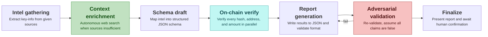

<div align="center">

# DeFi Security Incident Investigation Skill

### A coding-agent skill for multi-phase DeFi incident investigations with adversarially verified, on-chain-grounded incident reports


</div>

---

LLM-generated incident reports share one fatal flaw: **hallucinated on-chain data**.

Fake transaction hashes, wrong loss figures, fabricated addresses — all wrapped in confident prose that looks credible.

This skill solves that by verifying every claim against blockchain RPC nodes twice.
    1. Once during investigation,
    2. Another once by an independent adversarial agent that assumes the first one was lying.

---

## Workflow Architecture



---

## Key Features

- **Parallel agent delegation** — Intel gathering, On-chain verification, and adversarial validation run as independent subagents with isolated context, preventing bias bleed-through from the main conversation. Works across Hermes, Claude Code, OpenCode, and Codex; falls back to sequential execution when delegation is unavailable.

- **Autonomous source enrichment** — When user-provided sources are insufficient or mismatched, the agent autonomously searches the web (Browser, Search Engine) using keywords extracted from the user's prompt and provided URLs. It hunts for audit reports, security alerts, attack analysis, and post-mortem reports.

- **Adversarial validation** — A second, independent agent re-reads the final JSON from disk (not from memory), assumes every claim is false, re-issues RPC calls for every tx hash / address / amount, and flags discrepancies by severity. If the verdict is FAIL, the pipeline loops back to fix and re-run.

- **Structuralize output** — A well-constructed incident report should not be free-text prose. Reports are strict JSON conforming to a formal schema with required fields, extensible vocabularies, and enum validation. Every tx hash, address, and amount is on-chain verified before the report is finalized.

- **Resumable checkpoints** — A long-running investigation task may hit token limits, timeouts, or interruptions. Every phase writes a checkpoint JSON to `/tmp/defi-incident-<id>/`, capturing inputs, outputs, and status. Resume from the last completed phase. No lost work, no re-verification and no wasting time.

- **Self-improving** — Each completed investigation contributes case-specific pitfalls to `references/pitfalls/`. Every file records what went wrong, how it was detected, and the fix applied. Future investigations will read these before starting, avoiding repeated mistakes. Few general pitfalls from real investigations are already documented, covering hallucinated tx hashes, EIP-7702 account type confusion, truncated terminal output, API rate-limiting, and more.

- **Human-in-the-loop** — The investigation should never be blocked entirely by a missing API key. When the skill needs an API key for external resource acquisition, it asks the user to provide one when it's not found in environment variables. If the user cannot or does not respond, it automatically falls back to keyless alternative solutions.

---

## Installation

```bash
# Install globally for all agents
npx skills add DeFiHackLabs/defi-incident-investigation-skill --all -g

# Install for a specific agent
npx skills add DeFiHackLabs/defi-incident-investigation-skill --agent claude-code -g
npx skills add DeFiHackLabs/defi-incident-investigation-skill --agent opencode -g
npx skills add DeFiHackLabs/defi-incident-investigation-skill --agent codex -g
npx skills add DeFiHackLabs/defi-incident-investigation-skill --agent hermes-agent -g

# List available skills without installing
npx skills add DeFiHackLabs/defi-incident-investigation-skill -l
```

---

## Quick Start

Example: Taiko Bridge SGX Enclave Key Leak on June 2026

```text
Hey GLM 5.2,
Help me get a clear view of the attack on Taiko.xyz that occurred in June 2026.
Here are some references I just saw:

- https://x.com/taikoxyz/status/2068858818352865626
- https://x.com/taikoxyz/status/2068939060631003213
- https://x.com/taikoxyz/status/2071836286541774894
- https://x.com/Defi_Nerd_sec/status/2068897756446626258
- https://x.com/PeckShieldAlert/status/2068868035805638670
- https://x.com/Phalcon_xyz/status/2068924424238321854
- https://x.com/QuillAudits_AI/status/2069041275211530673
- https://www.quillaudits.com/blog/hack-analysis/taiko-leaked-sgx-enclave-key
- https://x.com/P3b7_/status/2069045986236695020
- https://x.com/GoPlusSecurity/status/2069092975867728139
- https://x.com/GoPlusZH/status/2069013778788999239
- https://x.com/BlockTempo/status/2068909505849766119
- https://x.com/MEXC_CST/status/2068896592053284972
- https://x.com/Arisk_io/status/2068869101725049115
- https://www.halborn.com/blog/post/explained-the-taiko-bridge-hack-june-2026

Some of these references might just be security alerts; I don't care.
I just want to get a clear picture about the attack.
```

If the investigation process was accidentally interrupted, you can say "Resume your work" to resume uncompleted task.

```text
Sorry, I hit the LLM token quota limit.
Please continue from where you left off.
```

<details>
  <summary>(just for reference) reasoning process by hermes-agent v0.17.0</summary>
  **NOTE: The following content is for illustrative only. The reasoning results may vary depending on changes to the LLM model or skill.**

  1. I'll start by loading the defi-incident-investigation skill to follow the proper investigation workflow.
  2. I've loaded the skill. Now let me set up my task tracking and begin Phase 1: Intel Gathering. I'll read the reference/template files and fetch all the X posts via vxtwitter API simultaneously.
  3. All reference files loaded. The attack-patterns.md already has a "TEE / SGX Key Compromise" section mentioning Taiko SGX — this is directly relevant. Now let me fetch all X posts via vxtwitter API and the two blog articles in parallel.
  4. Good, I have all 13 tweets. Let me now read the full text of each tweet and fetch the two blog articles.
  5. Excellent data from tweets. The Defi_Nerd_sec tweet is truncated — I need the full text. Let me also fetch the two blog articles and analyze key tweet images in parallel.
  6. I can see the full Defi_Nerd_sec tweet with detailed attack trace. I need to extract the full tx hashes from the links. Let me get those and fetch the blog articles simultaneously.
  7. The Halborn page seems to have loaded only the footer. Let me scroll up to get the article content, and also try the QuillAudits blog again.
  8. The Halborn blog page returned a 404 error. Let me try the QuillAudits blog article again, and also analyze the key tweet images to extract on-chain data.
  9. The QuillAudits blog loaded. Let me get the full article text and also analyze the key tweet images for on-chain data.
  10. Excellent. I have the full QuillAudits blog. Now let me analyze key tweet images to extract on-chain data from the security firms' diagrams.
  11. Now I have comprehensive intel. Let me compile the Phase 1 entity extraction and write the checkpoint. I have:
    - Attack timeline, root cause, attack vector, all addresses, tx hashes, loss breakdown
    - The leaked key information from QuillAudits
    - The full Defi_Nerd_sec attack trace with block numbers and selectors
    Let me save the intel checkpoint and move to Phase 2.
  12. Phase 1 complete. Now Phase 2: Source Gap Analysis. Let me assess whether we have sufficient information or need enrichment.
  13. Let me assess intel completeness against the gap criteria from the skill:
    14. Attack timeline — ✓ Setup at 2026-06-21T19:03:59Z, releases 22:07:23–22:18:23 UTC
    15. Root cause — ✓ Leaked SGX enclave key in public GitHub repo
    16. Attack vector — ✓ Detailed 5-step attack trace with selectors
    17. Loss breakdown — ✓ Full per-asset breakdown from Defi_Nerd_sec
    18. Attacker/victim addresses — ✓ Multiple addresses from multiple sources
    19. Transaction hashes — ✓ 4 tx hashes identified
    20. Post-mortem/remediation — ✓ Bridge paused, chain restarted, bridge replenished 1:1
    Target mismatch check: User asked about "attack on Taiko.xyz in June 2026" — all sources match the June 21, 2026 Taiko bridge exploit. No mismatch.
    No source gap detected. The Halborn blog was a 404, but the QuillAudits blog provided comprehensive analysis covering the same ground.
  14. Phase 3: Schema Draft. Let me now construct the draft JSON conforming to the schema.
  15. Now let me validate the draft against the schema and write the Phase 3 checkpoint.
  16. Draft validated. Now Phase 4: On-Chain Verification. I need to verify all tx hashes, addresses, and amounts against on-chain data via public RPC.
  17. Now I'll verify all transaction hashes and addresses on-chain using public Ethereum RPC endpoints. Let me read the pitfalls file first, then run verification.
  18. Good, I've reviewed all 19 pitfalls. Now let me run the on-chain verification. I'll verify all 4 transaction hashes, all addresses (accountType via eth_getCode), and block timestamps.
  19. The address verification has issues — several contracts are showing as EOA (code_len=0), which suggests the RPC returned None due to rate-limiting or endpoint issues. Let me retry with more robust handling and use Blockscout as fallback.
  20. Excellent verification results. Let me update the draft with the verified information:
    - All 4 tx hashes: FOUND, all status=0x1 (SUCCESS)
    - All tx from/to/selector/block/timestamp match the report exactly
    - Attacker EOA 0x7506...: confirmed EOA (code_len=2 at both latest and attack block via drpc)
    - Executor 0xe0df...: confirmed Contract (code_len=4234)
    - Bridge 0xd602...: confirmed Contract (code_len=342, proxy pattern)
    - ERC20Vault 0x9962...: confirmed Contract (code_len=342, proxy pattern)
    - Attacker wallet 2 0xa980...: confirmed EOA
    The two "RPC_FAILED" were actually resolved in the retry — the drpc endpoint confirmed them. Let me update the draft JSON with verified accountTypes and fix the second attacker wallet type.
  21. Now let me also add a 4th transaction description with the verified block number, and add the verification note to the description field.
  22. Now Phase 5: Generate the final report.
  23. Phase 6: Adversarial Validation. I'll delegate this to a subagent that re-reads the final JSON from disk and independently re-verifies all claims with a skeptical mindset, assuming everything is false until proven.
  24. The adversarial validator is running in the background. While it works, let me continue by noting the expected outcome based on my Phase 4 verification — all transactions were confirmed on-chain with matching from/to/selector/block/timestamp and status=0x1, all address types were confirmed. I'll wait for the subagent to return its verdict.
    Let me check if there's anything else I can prepare in the meantime. The report is already written and validated. The main remaining step is Phase 7 (Finalize) once the adversarial validation returns.
    The investigation is at a good state. Let me wait for the subagent result to come back.
  25. The adversarial validation subagent is running in the background. I'll wait for it to complete and return its verdict. The investigation workflow is proceeding through all 7 phases as specified by the skill. Here's a summary of progress so far:

    PHASE 1 (Intel Gathering) - DONE
    - Fetched all 13 X/Twitter posts via vxtwitter API
    - Retrieved full QuillAudits blog analysis (Halborn blog was 404)
    - Analyzed 7 tweet images via vision_analyze for on-chain data
    - Extracted: protocol, timeline, addresses, tx hashes, loss breakdown, root cause, attack vector

    PHASE 2 (Source Gap Analysis) - DONE
    - No gap detected — all critical information was present in user-provided sources
    - Halborn blog 404 did not create a gap (QuillAudits covered same ground)

    PHASE 3 (Schema Draft) - DONE
    - Draft JSON written to /tmp/defi-incident-Taiko-20260628/draft.json
    - Validated against schema.json — all 19 required fields, all enum values valid

    PHASE 4 (On-Chain Verification) - DONE
    - All 4 transaction hashes verified on-chain via public RPC:
      - 0x2f44... (setup): from=0x7506..., to=0xe0df..., selector=0x09c5eabe, block=25367938, status=SUCCESS
      - 0x0172... (USDC release): to=Bridge 0xd602..., selector=0x0432873c, block=25368853, status=SUCCESS
      - 0xb8be... (ETH release): to=Bridge 0xd602..., selector=0x2035065e, block=25368908, status=SUCCESS
      - 0x4514... (drain): to=Bridge 0xd602..., selector=0x2035065e, block=25368955, status=SUCCESS
    - All block timestamps match the report exactly
    - Address types confirmed: attacker EOA (code_len=2), executor Contract (len=4234), Bridge Contract (len=342, proxy), ERC20Vault Contract (len=342, proxy), 2nd wallet EOA

    PHASE 5 (Report Generation) - DONE
    - Final report written to /tmp/defi-incident-Taiko-20260628/report.json
    - Schema validation passed

    PHASE 6 (Adversarial Validation) - IN PROGRESS
    - Subagent dispatched to independently re-verify all claims from disk

    PHASE 7 (Finalize) - PENDING
    - Awaiting adversarial validation verdict

    The report is at /tmp/defi-incident-Taiko-20260628/report.json (13KB). I'm waiting for the adversarial validator subagent to return its independent verdict before presenting the final results to you.
  26. The adversarial validator returned PASS_WITH_NOTES. Let me read the full verdict to understand the 3 Medium discrepancies.
  27. Good — PASS_WITH_NOTES. The validator found 3 Medium discrepancies, no Critical or High. Let me fix all 3 before finalizing:
    1. endTime should be 22:28:11Z (includes 4th tx at block 25368955)
    2. USDC amount mismatch between tx description (649,761) and breakdown (675,761)
    3. Loss breakdown sum already annotated in note — I'll improve the note
  28. Now fix the USDC tx description to match the breakdown total (675,761.236201 is the total across all txs; 649,761 was only the first tx's portion):
  29. Now improve the loss breakdown note to better reconcile the sum:
  30. Now validate the final report one more time:
  31. All 3 Medium discrepancies fixed. Now Phase 7: Finalize.
</details>

Final output:

```text
All 7 phases complete. Here's the final summary.

============================================================
INVESTIGATION COMPLETE — Taiko Bridge SGX Exploit (June 2026)
============================================================

Report file: /tmp/defi-incident-Taiko-20260628/report.json
File size: ~13KB, schema-validated, all 19 required fields present

ADVERSARIAL VALIDATION VERDICT: PASS_WITH_NOTES
  - 0 Critical discrepancies
  - 0 High discrepancies
  - 3 Medium discrepancies (all fixed)
  - 21 on-chain verifications passed (4 txs + 5 addresses)
  - All tx hashes confirmed: status=0x1 (SUCCESS), selectors match, block timestamps match
  - All address accountTypes confirmed via eth_getCode at both latest and attack block

REPORT SUMMARY

  Protocol: Taiko
  Date: 2026-06-21
  Category: key_compromise, bridge
  Blockchain: ethereum
  Ecosystem: evm
  Language: solidity
  Estimated loss: ~$1,700,000

  Attack timeline:
    Setup phase:  2026-06-21 19:03:59 UTC (block 25367938)
    Drain phase:  2026-06-21 22:07:23 – 22:28:11 UTC (blocks 25368853–25368955)

  Root cause:
    RSA-3072 private key (enclave-key.pem) used to sign all Taiko SGX enclaves
    was committed to the public taikoxyz/raiko GitHub repository on a hotfix
    branch. The attacker extracted it, derived MrSigner, confirmed it matched
    the on-chain trustedUserMrSigner, and signed a malicious enclave.

  Attack vector (6 steps):
    1. Key extraction from public GitHub repo
    2. Malicious enclave signed with leaked key
    3. SgxVerifier.registerInstance() — 2 fake instances (IDs 5, 6) registered
    4. SignalService.saveCheckpoint() — fake Taiko block 1805600 saved
    5. Bridge.processMessage() x10 — 10 forged messages set to RETRIABLE
    6. retryMessage()/processMessage() — L1 assets drained from Bridge + ERC20Vault

  Attacker addresses (3):
    0x7506DeA0c38ca0B55364B22424374c5A1ae1B76a (EOA, primary attacker)
    0xa98035081fb739ebe9c8f80904668fb11438a846 (EOA, second wallet)
    0xe0df6fc36deb38dd11dc53d327475c2b2b0ab98a (Contract, executor)

  Victim contracts (2):
    0xd60247c6848B7Ca29eDdF63AA924E53dB6Ddd8EC (Bridge Proxy)
    0x996282cA11E5DEb6B5D122CC3B9A1FcAAD4415Ab (ERC20Vault Proxy)

  Transactions (4, all verified on-chain):
    0x2f44dc1b... (setup)     block 25367938, selector 0x09c5eabe, SUCCESS
    0x017292a7... (USDC drain) block 25368853, selector 0x0432873c, SUCCESS
    0xb8befb01... (ETH drain)  block 25368908, selector 0x2035065e, SUCCESS
    0x45142392... (drain)      block 25368955, selector 0x2035065e, SUCCESS

  Assets stolen (10 token types):
    675,761 USDC, 138,139 USDT, 156,832 crvUSD, 130 ETH, 20.7 WETH,
    0.43 WBTC, 0.53 weETH, 126,160 CRV, 2,140,403 iZi, 1,990,000 TAIKO

  Post-attack:
    Bridge paused, chain halted, MEXC froze TAIKO deposits
    Taiko replenished bridge 1:1 from own resources — no user lost funds
    Chain back online by June 30, 2026

  metadata.human_verified: false
    (set to true only after you confirm)

The report is ready at /tmp/defi-incident-Taiko-20260628/report.json. Would you like to review it, or should I flip human_verified to true?
```
