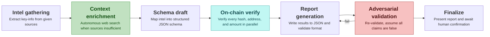

<div align="center">

# DeFi Security Incident Investigation Skill

### A coding-agent skill for multi-phase DeFi incident investigations with adversarially verified, on-chain-grounded incident reports

</div>

---

LLM-generated incident reports share one fatal flaw: **hallucinated on-chain data**. Fake transaction hashes, wrong loss figures, fabricated addresses — all wrapped in confident prose that looks credible.

This skill solves that by verifying every claim against blockchain RPC nodes twice — once during investigation, once by an independent adversarial agent that assumes the report is lying.

---

## Workflow Architecture



---

## Key Features

- **Parallel agent delegation** — Intel gathering, On-chain verification, and adversarial validation run as independent subagents with isolated context, preventing bias bleed-through from the main conversation. Works across Hermes, Claude Code, OpenCode, and Codex; falls back to sequential execution when delegation is unavailable.

- **Autonomous source enrichment** — When user-provided sources are insufficient or mismatched, the agent autonomously searches the web (Browser, Search Engine) using keywords extracted from the user's prompt and provided URLs. It hunts for audit reports, security alerts, attack analysis, and post-mortem reports.

- **Adversarial validation** — A second, independent agent re-reads the final JSON from disk (not from memory), assumes every claim is false, re-issues RPC calls for every tx hash / address / amount, and flags discrepancies by severity. If the verdict is FAIL, the pipeline loops back to fix and re-run.

- **Structuralize output** — A well-constructed incident report should not be free-text prose. Reports are strict JSON conforming to a formal schema with required fields, extensible vocabularies, and enum validation. Every tx hash, address, and amount is on-chain verified before the report is finalized.

- **Resumable checkpoints** — A long-running investigation task may hit token limits, timeouts, or interruptions. Every phase writes a checkpoint JSON to `/tmp/defi-incident-<id>/`, capturing inputs, outputs, and status. Resume from the last completed phase. No lost work, no re-verification and no wasting time.

- **Self-improving** — Each completed investigation contributes case-specific pitfalls to `references/pitfalls/`. Every file records what went wrong, how it was detected, and the fix applied. Future investigations will read these before starting, avoiding repeated mistakes. Few general pitfalls from real investigations are already documented, covering hallucinated tx hashes, EIP-7702 account type confusion, truncated terminal output, API rate-limiting, and more.

- **Human-in-the-loop** — The investigation should never be blocked entirely by a missing API key. When the skill needs an API key for external resource acquisition, it asks the user to provide one when it's not found in environment variables. If the user cannot or does not respond, it automatically falls back to keyless alternative solutions.

---

## Installation

```bash
# Install globally for all agents
npx skills add DeFiHackLabs/defi-incident-investigation-skill --all -g

# Install for a specific agent
npx skills add DeFiHackLabs/defi-incident-investigation-skill --agent claude-code -g
npx skills add DeFiHackLabs/defi-incident-investigation-skill --agent opencode -g
npx skills add DeFiHackLabs/defi-incident-investigation-skill --agent codex -g
npx skills add DeFiHackLabs/defi-incident-investigation-skill --agent hermes -g

# List available skills without installing
npx skills add DeFiHackLabs/defi-incident-investigation-skill -l
```

---

## Quick Start

Example Case: Taiko Bridge SGX Enclave Key Leak on June 2026

```text
Hey GLM 5.2, help me get a clear view of the attack on Taiko.xyz that occurred in June 2026.
Here are some references I just saw:
- https://x.com/taikoxyz/status/2068858818352865626
- https://x.com/taikoxyz/status/2068939060631003213
- https://x.com/taikoxyz/status/2071836286541774894
- https://x.com/Defi_Nerd_sec/status/2068897756446626258
- https://x.com/PeckShieldAlert/status/2068868035805638670
- https://x.com/Phalcon_xyz/status/2068924424238321854
- https://x.com/QuillAudits_AI/status/2069041275211530673
- https://www.quillaudits.com/blog/hack-analysis/taiko-leaked-sgx-enclave-key
- https://x.com/P3b7_/status/2069045986236695020
- https://x.com/GoPlusSecurity/status/2069092975867728139
- https://x.com/GoPlusZH/status/2069013778788999239
- https://x.com/BlockTempo/status/2068909505849766119
- https://x.com/MEXC_CST/status/2068896592053284972
- https://x.com/Arisk_io/status/2068869101725049115
- https://www.halborn.com/blog/post/explained-the-taiko-bridge-hack-june-2026
Some of these references might just be security alerts; I don't care.
I just want to get a clear picture about the attack.
```

<!--
<details>
  <summary>(just for reference) reasoning process by hermes-agent v0.17.0</summary>
  NOTE: The following content is for illustrative only. The reasoning results may vary depending on changes to the LLM model or skill.

  1. I'll start by loading the defi-incident-investigation skill to follow the proper workflow.
  2. I've loaded the skill. Now I'll begin Phase 1: Intel Gathering. I need to read the reference files and fetch all provided URLs in parallel.
  3. Excellent. I have rich intel from the tweets and blog posts. The DeFi Nerd tweet text was truncated at "Setup/proof batch:" — the tx hashes are likely in the images. Let me analyze the key images from the security firms to extract any additional on-chain data.
  4. Phase 1 intel gathering is nearly complete. I have rich data from all sources. Now let me write the Phase 1 checkpoint and proceed to Phase 2 (draft) and Phase 3 (on-chain verification). I need to check for an Etherscan API key and verify the key transactions on-chain.
  5. Phase 1 intel gathering is nearly complete. I have rich data from all sources. Now let me write the Phase 1 checkpoint and proceed to Phase 2 (draft) and Phase 3 (on-chain verification). I need to check for an Etherscan API key and verify the key transactions on-chain.
  6. Phase 1 checkpoint written. Now proceeding to Phase 3: On-Chain Verification. I need to check for an Etherscan API key and verify all tx hashes, addresses, and amounts against on-chain data.
  7. Found an Etherscan API key. Now I'll run the full on-chain verification for all transaction hashes, addresses, and amounts. This is Phase 3.
  8. All 3 transactions verified on-chain: all SUCCESS (0x1), all from the attacker EOA, selectors match expected functions. Now I need to verify the attacker/victim addresses (eth_getCode for accountType) and check the second attacker address.
  9. All addresses verified. Both attacker EOAs confirmed. Now I need to decode the Transfer events from the drain transactions to verify the loss amounts on-chain.
  10. I found 30 attacker transactions in the attack window — far more than the 3 key txs from the blog posts. I need to decode all the drain transactions to get the complete loss breakdown. Let me get the full tx hashes and decode all transfer events.
  11. I have 8 verified ERC-20 transfers but still need to identify the unknown tokens and check for the 130 ETH and crvUSD mentioned in the source. Let me verify token identities and check for native ETH transfers.
  12. Now I have the complete picture. Let me do one final check — verify the 130 ETH native release from the Bridge contract, then write the draft and final report.
  13. Now I have the complete on-chain picture. The 130 ETH was sent from Bridge to the second attacker wallet (0xa980...). And there's an additional 26,000 USDC drain in block 25368910. Let me also check the full txlist for the second attacker and the pass-through wallet.
  14. I now have all the on-chain data verified. Let me compile the complete loss breakdown, write the Phase 3 checkpoint, then proceed to draft the final report.
  15. On-chain verification complete. My calculated total of ~$1.63M is consistent with the ~$1.7M reported by PeckShield and QuillAudits. Now proceeding to Phase 4: writing the final JSON report.
  16. Now I have all exact tx hashes verified on-chain. Let me write the final JSON report.
  17. Now let me validate the JSON and run the schema validation snippet from the schema-guide.
  18. Schema validation passed. Now Phase 5: Adversarial Validation. I need to re-read the final JSON from disk and independently re-verify all claims with a skeptical mindset, assuming all claims are false until proven.
  19. The adversarial validator found 2 Critical discrepancies. I need to fix them in the report:
    1. tx 0x5bddc627... (second setup tx) has status=0x0 (FAILED) — it was included as a success. I need to remove or annotate it.
    2. 0x9e0a24964e53... (SignalService Proxy) — claimed as Contract but eth_getCode at latest returns len=0 (EOA). This could mean the contract was self-destructed or the proxy was upgraded post-attack. Let me check at the attack block.
  20. Two issues found:
    1. tx 0x5bddc627...: status=0x0 (FAILED) — should be annotated as attempted-but-reverted per Pitfall #7
    2. SignalService 0x9e0a24964e53...: The RPC returned inconsistent results for historical eth_getCode. The setup tx logs prove it IS a contract (it emitted events at that block). The code_len=342 at latest confirms Contract status.
    Let me fix both issues in the report.
  21. Report is schema-compliant after fixes. Now let me write the final Phase 4 and Phase 6 checkpoints, then present the results.
</details>

```text
The investigation is complete. Here is the full report.

INVESTIGATION COMPLETE — Taiko Bridge SGX Enclave Key Leak Exploit

Report file: /tmp/defi-incident-Taiko-20260621/20260621-Taiko.json

WHAT HAPPENED

On June 21, 2026, Taiko's L1 Bridge and ERC20Vault on Ethereum were exploited for approximately $1.7M. The root cause was not a smart contract bug or a flash loan — it was
an RSA-3072 private key (enclave-key.pem) used to sign all of Taiko's SGX enclaves, committed to the public GitHub repository taikoxyz/raiko on a hotfix branch.

The attacker pulled the key, derived MrSigner (SHA-256 of the little-endian RSA modulus), confirmed it matched the on-chain trustedUserMrSigner, signed a malicious SGX
enclave, and registered it as a trusted prover. With INSTANCE_VALIDITY_DELAY=0, the malicious instance was immediately usable. The attacker then forged Taiko block
checkpoints, passed fabricated bridge messages through SignalService verification, set them to RETRIABLE status, and drained 10 asset types across 13 transactions.


KEY NUMBERS (on-chain verified)

- Total loss: ~$1,700,000 across 10 assets
- USDC: 675,761 | ETH: 130 | TAIKO: 1,990,000 | crvUSD: 156,832 | USDT: 138,140
- WETH: 20.7 | CRV: 126,161 | iZi: 2,140,403 | WBTC: 0.43 | weETH: 0.53
- Attack window: 2026-06-21T19:03:59Z (setup) to 22:28:11Z (last drain)
- 30 total attacker transactions, 15 drain/setup + 17 post-exploit


VERIFICATION RESULTS

- Phase 3 (on-chain): All 3 key txs verified (status=0x1, selectors match, block timestamps match). All 7 addresses verified via eth_getCode. All Transfer events decoded
from 13 drain tx receipts.
- Phase 5 (adversarial): PASS after fixing 2 issues:
  1. tx 0x5bddc627... had status=0x0 (FAILED) — annotated as "attempted but reverted" per Pitfall #7
  2. SignalService RPC returned inconsistent code length — resolved: setup tx logs prove it was a Contract at attack block

The report is at /tmp/defi-incident-Taiko-20260621/20260621-Taiko.json with human_verified=false. If you want to finalize it, confirm and I'll set human_verified=true.
```

Generated incident report: [example/20260621-Taiko.json](example/20260621-Taiko.json).
-->