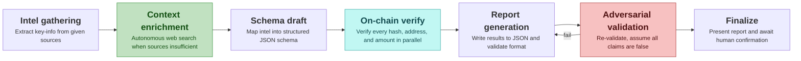

<div align="center">

# DeFi Security Incident Investigation Skill

### A coding-agent skill for multi-phase DeFi incident investigations with adversarially verified, on-chain-grounded incident reports


</div>

---

LLM-generated incident reports share one fatal flaw: **hallucinated on-chain data**.

Fake transaction hashes, wrong loss figures, fabricated addresses — all wrapped in confident prose that looks credible.

This skill solves that by verifying every claim against blockchain RPC nodes twice.

1. Once by the main investigator agent during report drafting;
2. Another one by an independent adversarial agent that assumes the investigator agent was lying.

---

## Workflow Architecture



---

## Key Features

- **Structuralize output** — A well-constructed incident report should not be free-text prose. Reports are strict JSON conforming to a formal schema with required fields, extensible vocabularies, and enum validation. Every tx hash, address, and amount is on-chain verified before the report is finalized.

- **Parallel agent delegation** — Intel gathering, On-chain verification, and adversarial validation run as independent subagents with isolated context, preventing bias bleed-through from the main conversation. Works across Hermes, Claude Code, OpenCode, and Codex; falls back to sequential execution when delegation is unavailable.

- **Autonomous source enrichment** — When user-provided sources are insufficient or mismatched, the agent autonomously searches the web (Browser, Search Engine) using keywords extracted from the user's prompt and provided URLs. It hunts for audit reports, security alerts, attack analysis, and post-mortem reports.

- **Adversarial validation** — A second, independent agent re-reads the final JSON from disk (not from memory), assumes every claim is false, re-issues RPC calls for every tx hash / address / amount, and flags discrepancies by severity. If the verdict is FAIL, the pipeline loops back to fix and re-run.

- **Resumable checkpoints** — A long-running investigation task may hit token limits, timeouts, or interruptions. Every phase writes a checkpoint JSON to `/tmp/defi-incident-<id>/`, capturing inputs, outputs, and status. Resume from the last completed phase. No lost work, no re-verification and no wasting time.

- **Self-improving** — Each completed investigation contributes case-specific pitfalls to `references/pitfalls/`. Every file records what went wrong, how it was detected, and the fix applied. Future investigations will read these before starting, avoiding repeated mistakes. Few general pitfalls from real investigations are already documented, covering hallucinated tx hashes, EIP-7702 account type confusion, truncated terminal output, API rate-limiting, and more.

- **Human-in-the-loop** — The investigation should never be blocked entirely by a missing API key. When the skill needs an API key for external resource acquisition, it asks the user to provide one when it's not found in environment variables. If the user cannot or does not respond, it automatically falls back to keyless alternative solutions.

---

## Installation

```bash
# Install globally for all agents
npx skills add DeFiHackLabs/defi-incident-investigation-skill --all -g

# Install for a specific agent
npx skills add DeFiHackLabs/defi-incident-investigation-skill --agent claude-code -g
npx skills add DeFiHackLabs/defi-incident-investigation-skill --agent opencode -g
npx skills add DeFiHackLabs/defi-incident-investigation-skill --agent codex -g
npx skills add DeFiHackLabs/defi-incident-investigation-skill --agent hermes-agent -g

# List available skills without installing
npx skills add DeFiHackLabs/defi-incident-investigation-skill -l
```

---

## Quick Start

Example Case: Taiko Bridge SGX Enclave Key Leak on June 2026

```text
Hey GLM 5.2,
Help me get a clear view of the attack against Taiko.xyz that occurred in June 2026.
Here are some references I just saw:

- https://x.com/taikoxyz/status/2068858818352865626
- https://x.com/taikoxyz/status/2068939060631003213
- https://x.com/taikoxyz/status/2071836286541774894
- https://x.com/Defi_Nerd_sec/status/2068897756446626258
- https://x.com/PeckShieldAlert/status/2068868035805638670
- https://x.com/Phalcon_xyz/status/2068924424238321854
- https://x.com/QuillAudits_AI/status/2069041275211530673
- https://www.quillaudits.com/blog/hack-analysis/taiko-leaked-sgx-enclave-key
- https://x.com/P3b7_/status/2069045986236695020
- https://x.com/GoPlusSecurity/status/2069092975867728139
- https://x.com/GoPlusZH/status/2069013778788999239
- https://x.com/BlockTempo/status/2068909505849766119
- https://x.com/MEXC_CST/status/2068896592053284972
- https://x.com/Arisk_io/status/2068869101725049115
- https://www.halborn.com/blog/post/explained-the-taiko-bridge-hack-june-2026

Some of these references might just be security alerts; I don't care.
I just want to get a clear picture about the attack.
```

If the investigation process was accidentally interrupted, you can say something like "Resume your work" to resume uncompleted task.

```text
I hit the LLM token quota limit.
Please continue from where you left off.
```

<details>
  <summary>Reasoning process by hermes-agent v0.17.0 (just for reference)</summary>
  The following content is for illustrative only. The reasoning results may vary depending on changes to the LLM model or skill.
  
  See [example/reasoning_process.md](example/reasoning_process.md).
</details>

Final output: 

See report: [example/20260621-Taiko.json](example/20260621-Taiko.json)

```text
All 7 phases complete. Here's the final summary.

============================================================
INVESTIGATION COMPLETE — Taiko Bridge SGX Exploit (June 2026)
============================================================

Report file: /tmp/defi-incident-Taiko-20260628/report.json
File size: ~13KB, schema-validated, all 19 required fields present

ADVERSARIAL VALIDATION VERDICT: PASS_WITH_NOTES
  - 0 Critical discrepancies
  - 0 High discrepancies
  - 3 Medium discrepancies (all fixed)
  - 21 on-chain verifications passed (4 txs + 5 addresses)
  - All tx hashes confirmed: status=0x1 (SUCCESS), selectors match, block timestamps match
  - All address accountTypes confirmed via eth_getCode at both latest and attack block

REPORT SUMMARY

  Protocol: Taiko
  Date: 2026-06-21
  Category: key_compromise, bridge
  Blockchain: ethereum
  Ecosystem: evm
  Language: solidity, rust
  Estimated loss: ~$1,700,000

  Attack timeline:
    Setup phase:  2026-06-21 19:03:59 UTC (block 25367938)
    Drain phase:  2026-06-21 22:07:23 – 22:28:11 UTC (blocks 25368853–25368955)

  Root cause:
    RSA-3072 private key (enclave-key.pem) used to sign all Taiko SGX enclaves
    was committed to the public taikoxyz/raiko GitHub repository on a hotfix
    branch. The attacker extracted it, derived MrSigner, confirmed it matched
    the on-chain trustedUserMrSigner, and signed a malicious enclave.

  Attack vector (6 steps):
    1. Key extraction from public GitHub repo
    2. Malicious enclave signed with leaked key
    3. SgxVerifier.registerInstance() — 2 fake instances (IDs 5, 6) registered
    4. SignalService.saveCheckpoint() — fake Taiko block 1805600 saved
    5. Bridge.processMessage() x10 — 10 forged messages set to RETRIABLE
    6. retryMessage()/processMessage() — L1 assets drained from Bridge + ERC20Vault

  Attacker addresses (3):
    0x7506DeA0c38ca0B55364B22424374c5A1ae1B76a (EOA, primary attacker)
    0xa98035081fb739ebe9c8f80904668fb11438a846 (EOA, second wallet)
    0xe0df6fc36deb38dd11dc53d327475c2b2b0ab98a (Contract, executor)

  Victim contracts (2):
    0xd60247c6848B7Ca29eDdF63AA924E53dB6Ddd8EC (Bridge Proxy)
    0x996282cA11E5DEb6B5D122CC3B9A1FcAAD4415Ab (ERC20Vault Proxy)

  Transactions (4, all verified on-chain):
    0x2f44dc1b... (setup)     block 25367938, selector 0x09c5eabe, SUCCESS
    0x017292a7... (USDC drain) block 25368853, selector 0x0432873c, SUCCESS
    0xb8befb01... (ETH drain)  block 25368908, selector 0x2035065e, SUCCESS
    0x45142392... (drain)      block 25368955, selector 0x2035065e, SUCCESS

  Assets stolen (10 token types):
    675,761 USDC, 138,139 USDT, 156,832 crvUSD, 130 ETH, 20.7 WETH,
    0.43 WBTC, 0.53 weETH, 126,160 CRV, 2,140,403 iZi, 1,990,000 TAIKO

  Post-attack:
    Bridge paused, chain halted, MEXC froze TAIKO deposits
    Taiko replenished bridge 1:1 from own resources — no user lost funds
    Chain back online by June 30, 2026

  metadata.human_verified: false
    (set to true only after you confirm)

The report is ready at /tmp/defi-incident-Taiko-20260628/report.json.
Would you like to review it, or should I flip human_verified to true?
```
